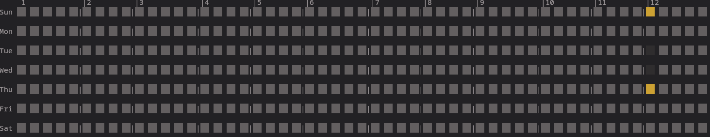

# GitHub Heatmap

GitHub Heatmap is a command-line tool that generates a heatmap of Git commit activity for a specified year. It visualizes the number of commits per day in a calendar-like format, similar to the contribution graph on GitHub profiles.



## Features

- Visualize commit activity for a specific year
- Customize the repository path
- Display commit counts using a color-coded heatmap


## Installation

To build the project, you need to have Rust and Cargo installed. Clone the repository and run:

```
cargo build --release
```


## License

This project is licensed under the MIT License. See the [LICENSE](LICENSE) file for details.

## Contributing

Contributions are welcome! Please open an issue or submit a pull request for any improvements or bug fixes.


### Options

- `-r, --repo <REPO>`: Specify the path to the Git repository. Defaults to the current directory if not provided.
- `-y, --year <YEAR>`: Specify the year for which to generate the heatmap. Defaults to the current year if not provided.

